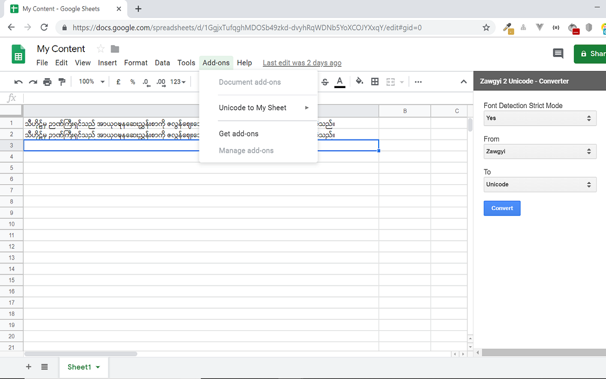

# Unicode to My Sheet - Google Sheet addon
**Google Spreadsheet Add-on** that can convert the sheet cell content from Zawgyi to Unicode and vice versa. 

  
## Features  
 - Font detection strict mode.
	 This option protects the common error that user unintentionally convert the content which is already in targeted encoding.
	 
 - Convert Zawgyi <=> Unicode.
	 Convert the selected spreadsheet content from Zawgyi to Unicode and vice versa.

## Usage

 - Click on "Unicode to My Sheet" addon.
-  When add-on page appears, choose the "Font Detection Strict mode - yes or no".
-  Choose "From" and "To" font.
-  Select the cell that you want to make conversion.
-  Click on "Convert" button.

## Credit
- [rabbit-converter](https://github.com/Rabbit-Converter)
- [knayi-font-detector](https://github.com/greenlikeorange/knayi-myscript)
      
### License [MIT](./LICENSE)